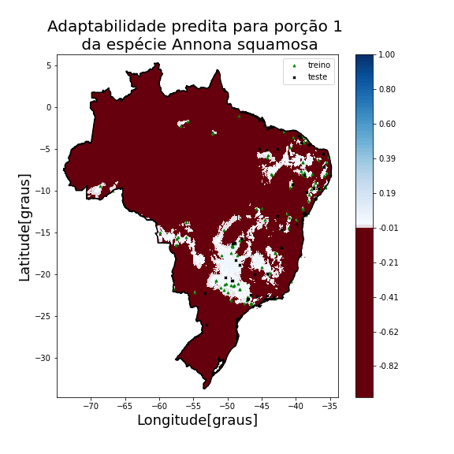
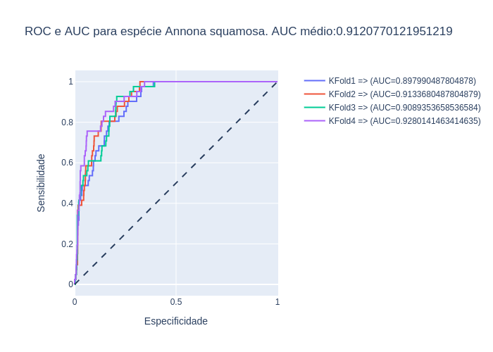

# Permapy


Permapy is the Degree Final Project created by <b>Matheus Gustavo Alves Sasso</b> at UNICAMP(State University of Campinas).

## Description

This project is a SDM (Species Distribution Modelling) focused on Brazilian vegetal species applied to agriculture. To create the species distributions species occurrences data were extracted from GBIF and environment data were extracted from the bases [ENVIREM](https://envirem.github.io/) and [BIOCLIM](https://www.worldclim.org/data/worldclim21.html).

The statistical technique used was the OCSVM (One Class Support Vector Machine) wich is special for detecting outliers. On the context of SDM this model makes a lot of sense because it separated environment data high related to species occurrences from those wich are not related, characterized as outliers.

To measure the performance of the algorithm the metrics used were ROC ( Receiver Operating Characteristic Curve) and AUC (Area Under Curve). To calculate those metric data were separated in 4 kfolds with the occurrences inference data was defined positives and 100000 randomly picked habitat data defined as negatives.

The project uses multiple strategies to overcome computer resources limitations to big data analyses. The steps on the section Getting Started will detail everything you must to to replicate the project.

## Getting Started


This project was created be run on Google Colab associate with Google Drive. To replicate this project it will be required to follow multiple steps described below:

1.	The first step is download raster .zip data provided in this [link](https://drive.google.com/drive/folders/10zYwG72yQlPUtVoZs5zb8SExdrlTKlKD?usp=sharing) and extract them inside the folder [Data/Rasters](Data/Rasters). This is a must do process and will take some hours depending on your internet.

2.	Next you must create a root folder with any name on Google Drive and put all this structure inside. This is a must do process and will take some hours depending on your internet.

3.	After that for every .ipynb file from the Pipeline and Prepipeline you must assign the ```project_root``` of your folder on google drive.

4. You must run the Prepiline completelly only once. For this there are two possible strategies:

	*	There are some code parts that takes long hours to run, so the fastest way is to run everything until the notebook section (Create Brazilian Mask) and download directly the data generated for the next steps from this link [Data/Rasters](Data/Rasters). The file [brazil_vars_mean_std.csv](https://drive.google.com/file/d/1JCzOiyfg1LSE9NMbLLUDcJBC0ako0w0Z/view?usp=sharing) have to be put inside the automatically created folder [Data/Standarized_Brazil_Data/CSV_Aux_Files] and the file [stacked_environment_rasters_array.npy](https://drive.google.com/file/d/1ziNV1IBB8dC22vUNOLfLFUbsWvbSrQWx/view?usp=sharing) have to be put inside the automatically created folder [Data/Standarized_Brazil_Data/Numpy_Aux_Files]

	*	The other strategy is just run the Prepiline completely. It will take long hours and is possible that Google Colab re-starts. To overcome this in every section the required info is recovered.
	
5.	With everythin prepared you must neatly run every step of the Pipeline. If you want to run for only one specie located on the file [species_taxon_id_dict.py](utils/species_taxon_id_dict.py), you must set the ```taxon_key``` parameter of this species and the parameter to ```collect_all=False```. Otherwise if you want to run for all the species set the parameter ```collect_all=True```.

6. Many folders will be automatically created. The results will be located in subfolders with species names inside the folder [Results](/Results).


## Studied Species

The studied species are located on the file [species_taxon_id_dict.py](utils/species_taxon_id_dict.py). Those are:

  
*	Canavalia ensiformis
*	Mucuna pruriens
*	Cajanus cajam
*	Leucaena leucocephala
*	Crotalaria juncea
*	Crotalaria spectabilis
*	Arachis pintoi
*	Pueraria phaseoloides
*	Trifolium repens
*	Stylosanthes guianensis
*	Neonotonia wightii
*	Inga edulis
*	Senna siamea
*	Erythrina verna
*	Dimorphandra mollis
*	Gliricidia sepium
*	Clitoria racemosa
*	Anacardium occidentale
*	Psidium guajava
*	Annona muricata
*	Annona squamosa
*	Mangifera indica
*	Malpighia emarginata
*	Musca paradisiaca
*	Spondias monbin
*	Carica papaya
*	Theobroma grandiflorum
*	Persea americana
*	Bactris gasipaes
*	Ananas comosus
*	Coffea arabica
*	Euterpe oleracea
*	Pterogyne nitens tul
*	Piptadenia gonoacantha
*	Schefflera morototoni
*	Andira fraxinifolia
*	Anadenanthera colubrina
*	Tachigali vulgaris
*	Guazuma ulmifolia
*	Enterolobium contortisiliquum

If you want to execute the project for your own interest species you should create a similiar dictionary structure in evey Pipeline file with the species Scientific Name and the GBIF taxon id. 


## Results

For every case species distributions maps and Kfold ROC curves with average AUC were created. One example for the species Annona squamosa cane be verified below:

* Species distribution:



* Kfold ROC and AUC:



The summary of the results can be checked on the table below:

**Species Name**|**Number of occurrences**|**Average AUC**
:-----:|:-----:|:-----:
Mucuna pruriens|34|0,903773
Cajanus cajam|210|0,923037
Leucaena leucocephala|346|0,93291
Crotalaria juncea|22|0,930217
Crotalaria spectabilis|30|0,910165
Arachis pintoi|24|0,898381
Pueraria phaseoloides|38|0,984403
Trifolium repens|137|0,990477
Stylosanthes guianensis|565|0,932941
Neonotonia wightii|34|0,956294
Inga edulis|300|0,896783
Senna siamea|60|0,921453
Erythrina verna|75|0,954124
Dimorphandra mollis|189|0,952107
Gliricidia sepium|25|0,923691
Anacardium occidentale|963|0,893253
Psidium guajava|1147|0,926334
Annona muricata|163|0,922288
Annona squamosa|163|0,912077
Mangifera indica|305|0,928954
Malpighia emarginata|28|0,943285
Musca paradisiaca|37|0,847883
Spondias monbin|60|0,932948
Carica papaya|2281|0,921508
Theobroma grandiflorum|35|0,924626
Persea americana|120|0,921889
Bactris gasipaes|20|0,849334
Ananas comosus|604|0,883551
Pterogyne nitens tul|217|0,97191
Piptadenia gonoacantha|233|0,958419
Schefflera morototon|246|0,895871
Andira fraxinifolia|354|0,963635
Anadenanthera colubrina|1319|0,936674
Tachigali vulgaris|147|0,923902
Guazuma ulmifolia|768|0,916104
Enterolobium contortisiliquum|321|0,926568


### Prerequisites

The prerequisites are almost all fulfilled natively by google colab. It was only required to install GeoPandas and Rasterio on the Pipeline and Prepiline files.


## Authors

**Matheus Gustavo Alves Sasso** - [math-sasso](https://github.com/math-sasso)

## Acknowledgments

The biggest acknowledgment is offered to my teacher <b>Paula Dornhofer Paro Costa</b>, for the tutoring provided during all the project period.